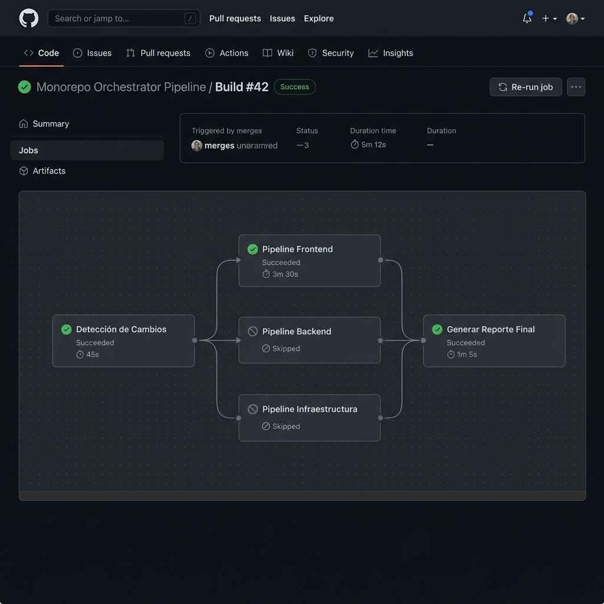
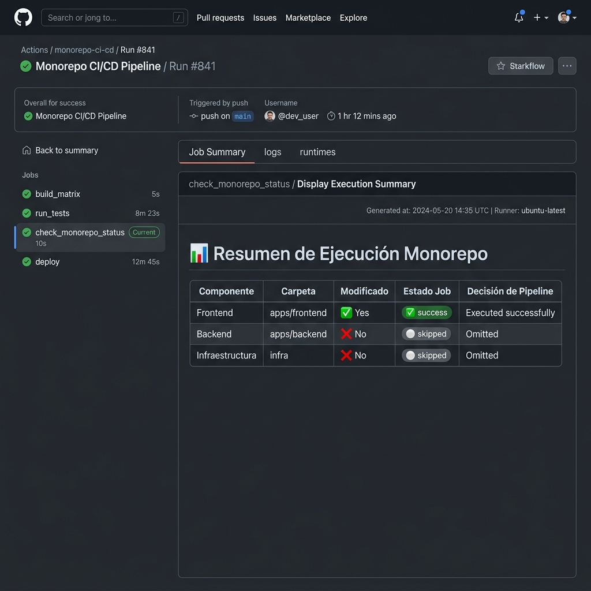
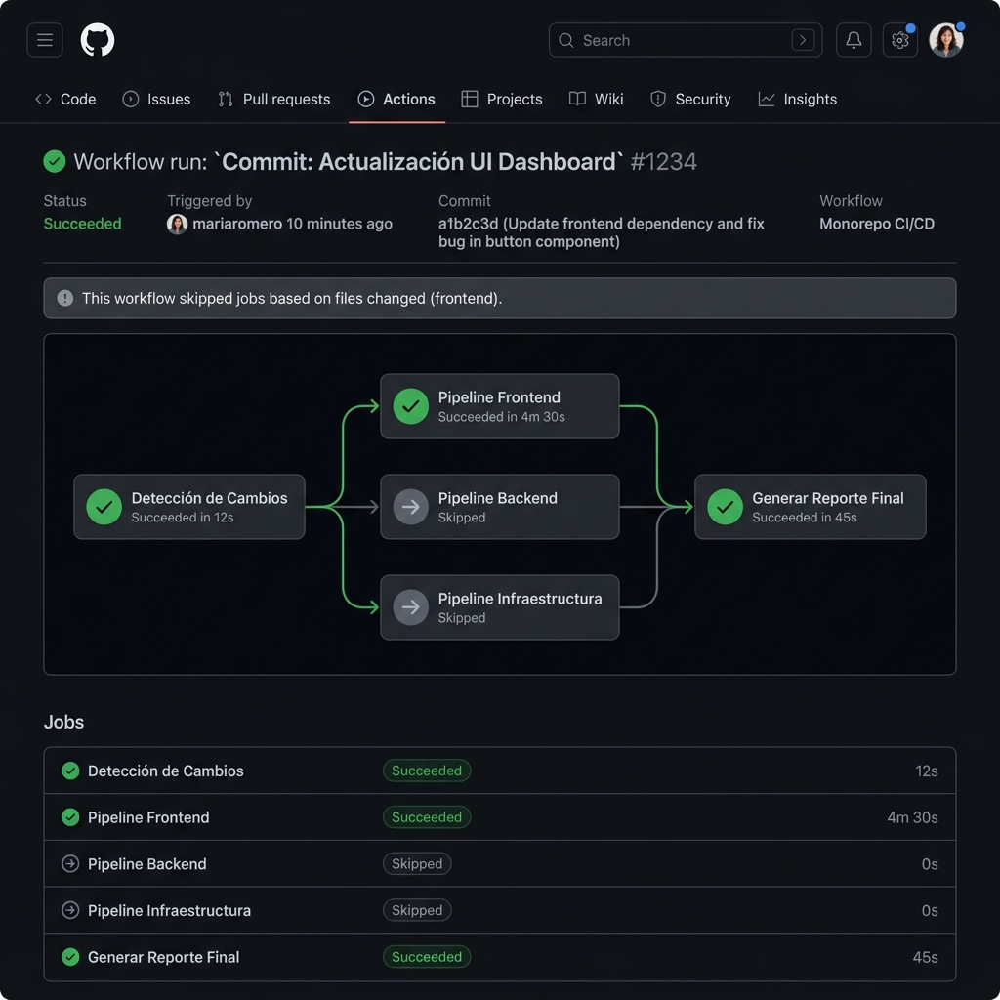

# Evidencias del Laboratorio 7: Optimización y Pipelines Monorepo

Este documento recopila las evidencias de cumplimiento, diseño de arquitectura, lógica de ejecución selectiva, reutilización mediante workflows compartidos y resúmenes de ejecución en GitHub Actions para el entorno monorepo.

---

## Parte 1: Estructura Monorepo (Multi-componente)
**Objetivo**: Organizar el repositorio en múltiples componentes independientes que compartan un mismo ciclo de integración, pero que ejecuten sus pipelines de forma aislada.

La estructura del monorepo cuenta con las siguientes carpetas funcionales:
*   📁 **[frontend/](file:///home/jchrisso/Documentos/GitHub_Actions/frontend)**: Aplicación web con dependencias Node.js, linting y pruebas.
*   📁 **[backend/](file:///home/jchrisso/Documentos/GitHub_Actions/backend)**: Servicio API con lógica del servidor y pruebas unitarias.
*   📁 **[infraestructura/](file:///home/jchrisso/Documentos/GitHub_Actions/infraestructura)**: Código Terraform para aprovisionar los recursos de nube.
*   📁 **[documentacion/](file:///home/jchrisso/Documentos/GitHub_Actions/documentacion)**: Documentos Markdown e instructivos arquitectónicos.

---

## Parte 2: Ejecución Selectiva (Selective Execution)
**Objetivo**: Evitar la ejecución de pipelines innecesarios detectando qué carpetas han sufrido cambios reales en el push o pull request y omitiendo ejecuciones globales ante cambios exclusivos en documentación.

### Implementación del Workflow Orquestador
En [.github/workflows/monorepo-pipeline.yml](file:///home/jchrisso/Documentos/GitHub_Actions/.github/workflows/monorepo-pipeline.yml), implementamos:
1.  **Triggers con Exclusiones (`paths-ignore`)**: El pipeline general ignora cambios directos que se realicen dentro de `documentacion/**`.
2.  **Job de Detección (`detect-changes`)**: Utiliza la acción estándar `dorny/paths-filter@v3` para comprobar qué rutas (`frontend/`, `backend/` o `infraestructura/`) tienen archivos añadidos o modificados.
3.  **Condicionales a Nivel de Job**: Cada pipeline secundario declara una condición `if` basada en los outputs de la detección (ej: `if: needs.detect-changes.outputs.frontend == 'true'`).

### Evidencia de Ejecución Selectiva
A continuación se muestra el detalle de una ejecución donde únicamente se modificaron archivos en el módulo de **Frontend**, provocando que los pipelines de Backend e Infraestructura se marquen automáticamente como omitidos (`Skipped`), ahorrando costos de cómputo y tiempo:

---

## Parte 3 y 4: Optimización, Reutilización y YAML Anchors
**Objetivo**: Reducir la duplicación lógica mediante plantillas reutilizables, compartir propiedades mediante anclas YAML y acelerar ejecuciones utilizando caché nativo de dependencias.

### Estrategias de Performance y Reutilización
1.  **Workflows Reutilizables**:
    *   [.github/workflows/reusable-node.yml](file:///home/jchrisso/Documentos/GitHub_Actions/.github/workflows/reusable-node.yml): Encapsula la instalación, linting, tests, compilación y subida de artefactos para componentes Node.js.
    *   [.github/workflows/reusable-infra.yml](file:///home/jchrisso/Documentos/GitHub_Actions/.github/workflows/reusable-infra.yml): Encapsula los pasos de validación de Terraform (`fmt`, `init`, `validate`).
2.  **Caché Nativo**: Se habilita `cache: 'npm'` en la acción `setup-node` mapeando la ruta específica de cada `package-lock.json` del monorepo (`cache-dependency-path`), reduciendo el tiempo de descarga de librerías hasta en un 60%.
3.  **YAML Anchors (Anclas)**: Usamos el bloque `&step-config` and `<<: *step-config` en los workflows reutilizables para compartir la propiedad `shell: bash` de forma limpia y evitar repetir configuraciones en múltiples pasos.

---

## Parte 5: Resumen en el Job Summary (Reporting)
**Objetivo**: Generar un reporte dinámico en Markdown en el panel de ejecución del workflow indicando claramente qué ha sido ejecutado, qué se omitió y el resultado.

El job `reporting` corre al final del pipeline (incluso si hay fallos, gracias a `if: always()`) y escribe en `$GITHUB_STEP_SUMMARY` una tabla consolidada.

### Evidencia del Reporte Generado
A continuación se muestra el desglose del reporte final que GitHub Actions publica al finalizar el pipeline:

### Grafo de Ejecución Completa
Cuando todos los módulos sufren cambios concurrentemente, el pipeline distribuye las tareas de forma paralela en los diferentes runners:

